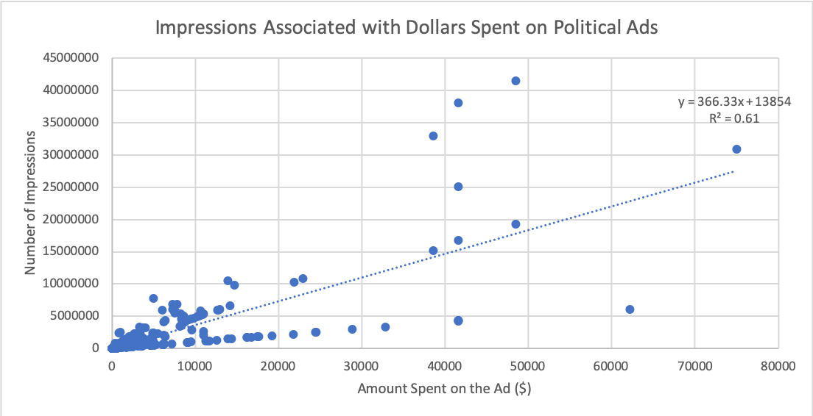

# 0228-Snapchat-2020_Sanny-YE

I  Brief Description 

In this project, we are using the existing 560 data points provided on the snapchat website to explore the relationship between and amount spent on political ads on Snapchat along with active days, and impressions that ads have received in the United States in 2020. We found a relationship between the amount spent on advertisement on Snapchat in the U.S; however, since most of the projects are still ongoing, we failed to find a relationship between impressions and active days. 

II  Outline 

Industry Question: Is there a trend in terms of investing in political ads on Snapchat in the United States? How many impressions should companies/organizations expect if budget and active days are known?

Data Question: Are dollars spent on political ads and the number of days for which ads are active good predictors for the amount of impressions generated? What is the relationship among these variables?

Data Answer: A relationship between the amount spent on advertisement on Snapchat in the U.S. was found as the number of impressions increases by ~366 for every dollar spent on the ad. This relationship holds true for over 60% the 560 data points we have in year 2020.

Industry Answer Findings: There is a clear connection between the amount of money spent on ads on Snapchat and impressions that ads receive, so organizations can make predictions according to the regression model prior to launching the advertisement. The relationship between the number of days in which adds are active and impressions generated are still yet to be explored using data from previous years as we don’t see a significant connection between the two variables in this project.

III  Step by Step Description

https://drive.google.com/file/d/1Te5eqKiZf_Htp4UF6UOI1nqIiO8NyMZ7/view?usp=sharing

IV  Conclusion

Based on the regression model, we found a relationship between the amount spent on advertisement on Snapchat in the U.S. as the number of impressions increases by ~366 for every dollar spent on the ad. This relationship holds true for over 60% the 560 data points we have generated in year 2020. This result intuitively makes sense because the more organizations spend on an ad, the broader the ad spreads and more people might watch the ad. Surprisingly, we found that number of days in which ads are active does not have a significant impact on the amount of impressions received. This might be due to the limitation of data we have (since the year 2020 has just started) or inaccurate data points.

V  Website Links to Data Sources

1)	https://www.snap.com/en-US/political-ads/
